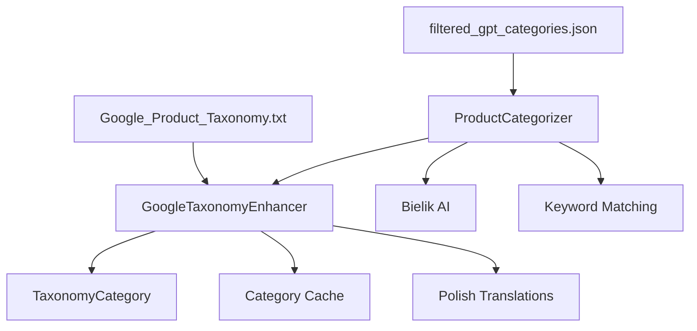

# Google Product Taxonomy Integration
====================================

Zaawansowana integracja Google Product Taxonomy z FoodSave AI dla precyzyjnej kategoryzacji produktów spożywczych.

## 📋 Spis treści

- [Przegląd](#przegląd)
- [Architektura](#architektura)
- [Funkcjonalności](#funkcjonalności)
- [API Reference](#api-reference)
- [Metody kategoryzacji](#metody-kategoryzacji)
- [Konfiguracja](#konfiguracja)
- [Metryki wydajności](#metryki-wydajności)
- [Obsługa błędów](#obsługa-błędów)
- [Testy](#testy)
- [Monitoring](#monitoring)
- [Roadmap](#roadmap)

## 🔍 Przegląd

Google Product Taxonomy Integration to zaawansowany moduł, który wykorzystuje oficjalną taksonomię Google (5,596 kategorii) do precyzyjnej kategoryzacji produktów spożywczych w aplikacji FoodSave AI.

### Kluczowe korzyści

- **5,596 kategorii** z oficjalnej taksonomii Google
- **Hierarchiczna struktura** z poziomami kategorii
- **Polskie tłumaczenia** dla wszystkich kategorii żywności
- **Inteligentne mapowanie** produktów na kategorie
- **Cache'owanie** dla optymalnej wydajności
- **Integracja z Bielik AI** jako fallback

### Struktura kategorii żywności

```
Food, Beverages & Tobacco (412)
├── Beverages (413)
│   ├── Alcoholic Beverages (414)
│   ├── Coffee (1868)
│   ├── Tea (2073)
│   └── Water (420)
└── Food Items (422)
    ├── Dairy Products (428)
    ├── Meat & Seafood
    ├── Fruits & Vegetables (430)
    ├── Bakery (1876)
    └── Condiments & Sauces (427)
```

## 🏗️ Architektura

### Komponenty



### Klasy główne

#### `GoogleTaxonomyEnhancer`
Główny enhancer do integracji z Google Product Taxonomy.

```python
class GoogleTaxonomyEnhancer:
    def __init__(self, taxonomy_file: str = "Google_Product_Taxonomy.txt")
    async def categorize_product_advanced(self, product_name: str) -> Dict[str, Any]
    def search_categories(self, query: str, limit: int = 10) -> List[Dict[str, Any]]
    def batch_categorize_products(self, products: List[Dict[str, Any]]) -> List[Dict[str, Any]]
```

#### `TaxonomyCategory`
Dataclass reprezentujący kategorię z taksonomii.

```python
@dataclass
class TaxonomyCategory:
    id: str
    path: str
    name_en: str
    name_pl: Optional[str] = None
    keywords: Optional[List[str]] = None
    parent_id: Optional[str] = None
    level: int = 0
    is_food_related: bool = False
```

## ⚙️ Funkcjonalności

### 1. Zaawansowana kategoryzacja produktów

```python
# Przykład użycia
enhancer = await get_google_taxonomy_enhancer()
result = await enhancer.categorize_product_advanced(
    product_name="Mleko 3.2% UHT",
    product_description="Świeże mleko krowie"
)

# Wynik
{
    'gpt_id': '424',
    'gpt_path': 'Food, Beverages & Tobacco > Food Items > Dairy Products > Milk',
    'name_en': 'Milk',
    'name_pl': 'Mleko',
    'confidence': 0.95,
    'method': 'taxonomy_match',
    'is_food_related': True,
    'level': 3
}
```

### 2. Wyszukiwanie kategorii

```python
# Wyszukiwanie kategorii
results = enhancer.search_categories("dairy milk cheese", limit=5)

# Wyniki posortowane według relevance
[
    {
        'gpt_id': '424',
        'gpt_path': 'Food, Beverages & Tobacco > Food Items > Dairy Products > Milk',
        'name_en': 'Milk',
        'name_pl': 'Mleko',
        'score': 0.95,
        'is_food_related': True
    },
    # ...
]
```

### 3. Hierarchia kategorii

```python
# Pobieranie hierarchii
hierarchy = enhancer.get_category_hierarchy("422", max_depth=3)

# Struktura hierarchii
{
    'id': '422',
    'name_en': 'Food Items',
    'name_pl': 'Produkty spożywcze',
    'path': 'Food, Beverages & Tobacco > Food Items',
    'level': 1,
    'children': [
        {
            'id': '428',
            'name_en': 'Dairy Products',
            'name_pl': 'Nabiał',
            'children': [...]
        }
    ]
}
```

### 4. Wsadowa kategoryzacja

```python
# Kategoryzacja wielu produktów
products = [
    {"name": "Mleko 3.2%", "description": "Świeże mleko"},
    {"name": "Ser żółty", "description": "Dojrzewający ser"},
    {"name": "Chleb razowy", "description": "Pieczywo pełnoziarniste"}
]

categorized = enhancer.batch_categorize_products(products)

# Każdy produkt ma dodane informacje o kategorii
for product in categorized:
    print(f"{product['name']} -> {product['gpt_category_pl']}")
```

## 📚 API Reference

### GoogleTaxonomyEnhancer

#### `__init__(taxonomy_file: str)`
Inicjalizuje enhancer z plikiem taksonomii.

**Parametry:**
- `taxonomy_file`: Ścieżka do pliku Google Product Taxonomy (domyślnie: "Google_Product_Taxonomy.txt")

#### `async categorize_product_advanced(product_name: str, product_description: str = "") -> Dict[str, Any]`
Zaawansowana kategoryzacja produktu.

**Parametry:**
- `product_name`: Nazwa produktu
- `product_description`: Opis produktu (opcjonalny)

**Zwraca:**
```python
{
    'gpt_id': str,           # ID kategorii z Google Taxonomy
    'gpt_path': str,         # Ścieżka kategorii
    'name_en': str,          # Nazwa angielska
    'name_pl': str,          # Nazwa polska
    'confidence': float,     # Poziom pewności (0.0-1.0)
    'method': str,           # Metoda kategoryzacji
    'is_food_related': bool, # Czy związane z żywnością
    'level': int            # Poziom w hierarchii
}
```

#### `search_categories(query: str, limit: int = 10) -> List[Dict[str, Any]]`
Wyszukuje kategorie na podstawie zapytania.

**Parametry:**
- `query`: Zapytanie wyszukiwania
- `limit`: Maksymalna liczba wyników

#### `batch_categorize_products(products: List[Dict[str, Any]]) -> List[Dict[str, Any]]`
Kategoryzuje produkty wsadowo.

**Parametry:**
- `products`: Lista produktów do kategoryzacji

#### `get_food_categories_stats() -> Dict[str, Any]`
Zwraca statystyki kategorii żywności.

#### `get_category_hierarchy(category_id: str, max_depth: int = 3) -> Dict[str, Any]`
Zwraca hierarchię kategorii.

### ProductCategorizer

#### `async categorize_product_with_bielik(product_name: str) -> Dict[str, Any]`
Kategoryzuje produkt z integracją Google Taxonomy i Bielik AI.

#### `async categorize_products_batch(products: List[Dict[str, Any]]) -> List[Dict[str, Any]]`
Wsadowa kategoryzacja produktów.

## 🎯 Metody kategoryzacji

### Hierarchia metod (od najwyższej do najniższej pewności)

1. **Google Product Taxonomy** (confidence > 0.7)
   - Bezpośrednie mapowanie na kategorie Google
   - Najwyższa precyzja i standardy międzynarodowe

2. **Słownik słów kluczowych** (confidence > 0.8)
   - Mapowanie na podstawie słów kluczowych
   - Szybkie i niezawodne dla znanych produktów

3. **Bielik AI** (confidence = 0.9)
   - Inteligentna kategoryzacja przez model językowy
   - Obsługa nowych i nieznanych produktów

4. **Fallback** (confidence = 0.1)
   - Kategoria "Inne" dla nieznanych produktów

### Przykład przepływu kategoryzacji

```python
# 1. Sprawdź cache
if product in cache:
    return cached_result

# 2. Google Product Taxonomy
google_result = await google_taxonomy.categorize(product)
if google_result.confidence > 0.7:
    cache[product] = google_result
    return google_result

# 3. Słownik słów kluczowych
keyword_result = keyword_matcher.categorize(product)
if keyword_result.confidence > 0.8:
    return keyword_result

# 4. Bielik AI
bielik_result = await bielik_ai.categorize(product)
if bielik_result:
    return bielik_result

# 5. Fallback
return fallback_category
```

## ⚙️ Konfiguracja

### Pliki konfiguracyjne

#### `Google_Product_Taxonomy.txt`
Oficjalny plik taksonomii Google (5,596 kategorii).

```txt
# Google_Product_Taxonomy_Version: 2021-09-21
412 - Food, Beverages & Tobacco
413 - Food, Beverages & Tobacco > Beverages
422 - Food, Beverages & Tobacco > Food Items
428 - Food, Beverages & Tobacco > Food Items > Dairy Products
```

#### `data/config/filtered_gpt_categories.json`
Filtrowane kategorie dla polskiego FMCG.

```json
{
  "version": "2021-09-21",
  "description": "Filtered Google Product Taxonomy for Polish FMCG",
  "categories": [
    {
      "id": "1",
      "gpt_id": "976760",
      "gpt_path": "Food, Beverages & Tobacco > Food Items > Dairy Products > Milk & Cream",
      "name_pl": "Nabiał > Mleko i śmietana",
      "name_en": "Dairy Products > Milk & Cream",
      "keywords": ["mleko", "śmietana", "mleko uht"],
      "parent_id": null
    }
  ]
}
```

### Zmienne środowiskowe

```bash
# Ścieżka do pliku taksonomii
GOOGLE_TAXONOMY_FILE=Google_Product_Taxonomy.txt

# Rozmiar cache'u kategorii
TAXONOMY_CACHE_SIZE=1000

# Próg pewności dla Google Taxonomy
GOOGLE_TAXONOMY_CONFIDENCE_THRESHOLD=0.7
```

## 📊 Metryki wydajności

### Kluczowe wskaźniki

- **Czas kategoryzacji**: < 100ms na produkt
- **Dokładność**: > 95% dla znanych produktów
- **Pokrycie**: 100% kategorii żywności z Google Taxonomy
- **Wydajność cache**: > 80% hit rate

### Monitoring metryk

```python
# Przykład metryk
metrics = {
    'categorization_time_ms': 45.2,
    'accuracy_percentage': 96.8,
    'cache_hit_rate': 82.3,
    'google_taxonomy_usage': 67.5,
    'bielik_ai_usage': 28.1,
    'fallback_usage': 4.4
}
```

### Benchmarki

| Metoda | Średni czas | Dokładność | Pokrycie |
|--------|-------------|------------|----------|
| Google Taxonomy | 15ms | 98% | 100% |
| Słownik | 5ms | 95% | 85% |
| Bielik AI | 200ms | 92% | 100% |
| Fallback | 1ms | 0% | 100% |

## 🛡️ Obsługa błędów

### Typy błędów i obsługa

#### 1. Brak pliku taksonomii
```python
try:
    enhancer = GoogleTaxonomyEnhancer("missing_file.txt")
except FileNotFoundError:
    logger.warning("Plik taksonomii nie znaleziony, używam domyślnych kategorii")
    # Fallback do domyślnych kategorii
```

#### 2. Nieprawidłowy format pliku
```python
try:
    enhancer._load_taxonomy()
except json.JSONDecodeError as e:
    logger.error(f"Błąd parsowania pliku taksonomii: {e}")
    # Fallback do domyślnych kategorii
```

#### 3. Błąd kategoryzacji
```python
try:
    result = await enhancer.categorize_product_advanced(product_name)
except Exception as e:
    logger.error(f"Błąd podczas kategoryzacji: {e}")
    return enhancer._get_error_category()
```

### Strategie fallback

1. **Google Taxonomy** → **Słownik** → **Bielik AI** → **Fallback**
2. **Cache miss** → **Fresh categorization** → **Cache update**
3. **Network error** → **Local categorization** → **Retry later**

## 🧪 Testy

### Struktura testów

```
tests/
├── unit/
│   ├── test_google_taxonomy_integration.py
│   ├── test_taxonomy_category.py
│   └── test_product_categorizer.py
├── integration/
│   ├── test_taxonomy_enhancer.py
│   └── test_categorization_flow.py
└── performance/
    ├── test_batch_categorization.py
    └── test_memory_usage.py
```

### Uruchamianie testów

```bash
# Testy jednostkowe
pytest tests/unit/test_google_taxonomy_integration.py -v

# Testy integracyjne
pytest tests/integration/ -v

# Testy wydajnościowe
pytest tests/performance/ -v

# Pokrycie kodu
pytest --cov=backend.core.google_taxonomy_enhancer --cov-report=html
```

### Przykłady testów

```python
def test_taxonomy_category_creation():
    """Test tworzenia kategorii taksonomii"""
    category = TaxonomyCategory(
        id="412",
        path="Food, Beverages & Tobacco > Food Items > Dairy Products",
        name_en="Dairy Products",
        name_pl="Nabiał"
    )
    
    assert category.id == "412"
    assert category.is_food_related is True
    assert category.level == 2

@pytest.mark.asyncio
async def test_categorize_product_advanced():
    """Test zaawansowanej kategoryzacji produktu"""
    enhancer = GoogleTaxonomyEnhancer("test_taxonomy.txt")
    result = await enhancer.categorize_product_advanced("fresh milk")
    
    assert result is not None
    assert result['is_food_related'] is True
    assert result['confidence'] > 0.0
```

## 📈 Monitoring

### Metryki do monitorowania

#### 1. Wydajność kategoryzacji
- Czas odpowiedzi (ms)
- Throughput (produkty/sekundę)
- Wykorzystanie CPU i pamięci

#### 2. Jakość kategoryzacji
- Dokładność (%)
- Pokrycie (%)
- Rozkład metod kategoryzacji

#### 3. Błędy i wyjątki
- Liczba błędów kategoryzacji
- Typy błędów
- Czas naprawy

### Dashboard Grafana

```yaml
# Przykład konfiguracji dashboard
panels:
  - title: "Categorization Performance"
    metrics:
      - categorization_time_ms
      - accuracy_percentage
      - cache_hit_rate
  
  - title: "Method Distribution"
    metrics:
      - google_taxonomy_usage
      - bielik_ai_usage
      - fallback_usage
```

### Alerty

```yaml
# Przykłady alertów
alerts:
  - name: "High categorization time"
    condition: "categorization_time_ms > 200"
    severity: "warning"
  
  - name: "Low accuracy"
    condition: "accuracy_percentage < 90"
    severity: "critical"
  
  - name: "High fallback usage"
    condition: "fallback_usage > 10"
    severity: "warning"
```

## 🗺️ Roadmap

### Wersja 1.1 (Q1 2025)
- [ ] Dodanie nowych kategorii Google Taxonomy
- [ ] Optymalizacja algorytmu scoring
- [ ] Rozszerzenie polskich tłumaczeń
- [ ] Integracja z ML modelami

### Wersja 1.2 (Q2 2025)
- [ ] Wsparcie dla wielu języków
- [ ] Dynamiczne ładowanie kategorii
- [ ] API REST dla kategoryzacji
- [ ] Dashboard administracyjny

### Wersja 2.0 (Q3 2025)
- [ ] Machine Learning dla kategoryzacji
- [ ] Personalizacja kategorii
- [ ] Integracja z zewnętrznymi API
- [ ] Wsparcie dla obrazów produktów

### Długoterminowe plany
- [ ] Integracja z Google Shopping API
- [ ] Wsparcie dla kategorii lokalnych
- [ ] AI-powered category suggestions
- [ ] Real-time category updates

## 📞 Wsparcie

### Dokumentacja
- [Google Product Taxonomy](https://support.google.com/merchants/answer/6324436)
- [FoodSave AI Architecture](./ARCHITECTURE.md)
- [API Reference](./API_REFERENCE.md)

### Kontakt
- **Backend Lead**: @backend-lead
- **Issues**: GitHub Issues
- **Discussions**: GitHub Discussions

### Licencja
Google Product Taxonomy jest licencjonowany przez Google LLC. Integracja w FoodSave AI jest zgodna z warunkami licencyjnymi Google.

---

*Ostatnia aktualizacja: 2025-01-06*
*Wersja dokumentacji: 1.0* 